### A Safer Way to Open the US

### Initial Summary

As the states and cities of the United States consider reducing the stringency of shelter-in-place orders and social distancing guidelines, we face the most difficult policy choices. This paper proposes a new policy option of protecting the vulnerable for dealing with next phase of the Coronavirus epidemic in the United States. The case for protecting the vulnerable as cities open more is based on four points:

1. As cities and states start to loosen social distancing and shelter-in-place restrictions to allow more econonic activity and a return to some normal daily activities, infection cases and deaths will rise. Epidemiology models clearly show this and some states are alreading experiencing it. We need a way forward that does enable more activity while preventing a large increase in the number of deaths.
2. Most of the deaths that have occurred to date have affected people over sixty with co-existing chronic disease conditions and a small percentage of working age and younger people who also suffer co-existing conditions. Approximately 37% of all deaths in the United States as of May 21 had occurred in elderly care facilities and over 50% in 15 states[1]. This concentration of deaths in one segment of the population will enable us to focus on people most at risk rather than trying to prevent infection across the entire population. 
3. Test, trace and isolate is the recommended public health policy for reducing new cases of Covid-19 and additional deaths. This policy requires nearly perfect implementation that will be difficult to achieve and will probably face a lack of social cooperation, especially among proponents of aggressively “opening up.”
4. Protect the vulnerable focuses on preventing an increase in deaths among the elderly and other vulnerable people while loosening shelter-in-place restrictions for the working age and school age population. This policy requires less testing capacity and relies on a social contract that will be easier to understand and can gain greater social cooperation than test and trace.

We exclude the approach that some governments lean towards, which assumes that the severity of the Covid-19 epidemic is over-rated; that a rise of infection cases and deaths won’t occur; and that economic recovery is an acceptable trade-off even if there is an increase in deaths. This is not an option because the increase in deaths will be intolerable. We will show that protect the vulnerable can achieve a death rate in line with prolonged stringent social distancing, which is now ending across much of the US and faces considerable resistance. At the same time, the plan allows significantly lessening the restrictions on work and school for most people. We suggest a working plan for achieving two goals: minimizing death rates and enabling fewer restrictions on daily activity. 

### Epidemic Response to “Opening Up”

Before we look at what happens when social distancing restrictions are reduced, we start by looking at what happens when there is no social distancing or isolation in a small city, Bismarck, ND, and a very large city, New York. We are using an epidemiological model based on how social interactions cause the spread of the virus in groups of people in 5 age groups. The virus is introduced into each locale by just 6 people and spreads through social contact. After people contract the disease they progress through different illness conditions—“nil” for asymptomatic, mild, sick, and severe—for up to 25 days (in reality, a desparate few severe patients remain hospitalized for longer times), resulting in outcomes of either recovering or dying. The model is briefly explained in a bit more detail in appendix 1. 

Figure 1 shows simulations of Bismarck and New York City.  There is no social distancing or isolation—as a base case. Nothing like this has happened or will happen: this is Covid-19 running completely unchecked. Looking at the Bismarck example on the left side of figure 1, here is what the plot shows. The simulation runs for 180 days. At the beginning, the entire population is unexposed to the virus. On day 1, six people arrive who are infectious. As people become infected, the black “Unexposed” line goes down.  The orange line labeled “Infectious” shows people who have the virus—some have symtoms; some don’t; and the degree to which they can infect others varies over the time they have the virus. Over time, most people who are “Infectious” recover and they are shown on the blue line labeled “Recovered”. A small percentage of the people who were “Infectious” die as shown by the green line labeled “Dead.” All of the graphs show the total number of people who ever got infected and the total number people who died during the 180 days of the simulation. We use these two outcomes to compare the different policy alternatives.

| Bismarck: unchecked virus           | New York: unchecked virus           |
|:-----------------------------------:|:-----------------------------------:|
| 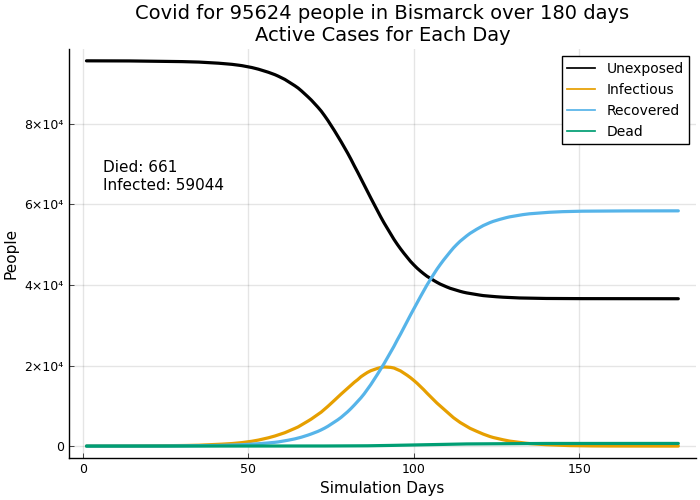 | 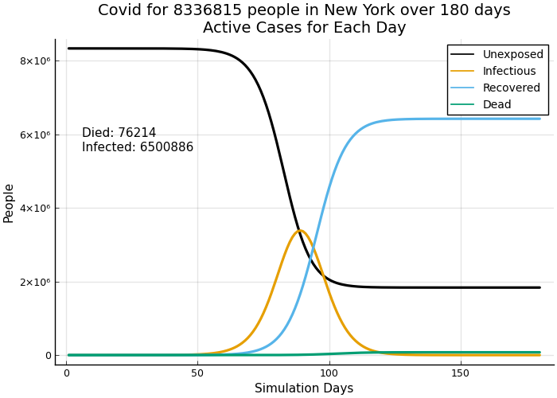 |

  <b>Fig. 1: No social distancing or isolation</b>

Figure 2 below shows strong social distancing starting on day 50. This would be late March in NYC and perhaps early April in Bismarck. Note how much lower the number of deaths and the number of infected are compared to the unchecked virus. However, these death counts are different than you will find on the Johns Hopkins or Worldometer dashboards because the simulation is run for 180 days and as of May 23, 2020 we had reached day 122 in the Johns Hopkins data used by many media outlets. Also, the simulation counts every case of infection and every death. This differs from published reports, which usually don't count infected people who never seek medical care or who may have died without ever having been tested for the virus.

| Bismarck: social distancing         | New York: social distancing         |
|:-----------------------------------:|:-----------------------------------:|
| 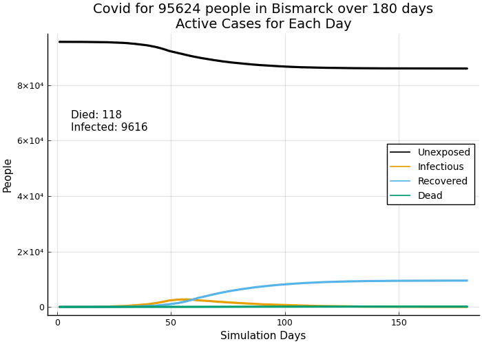 | 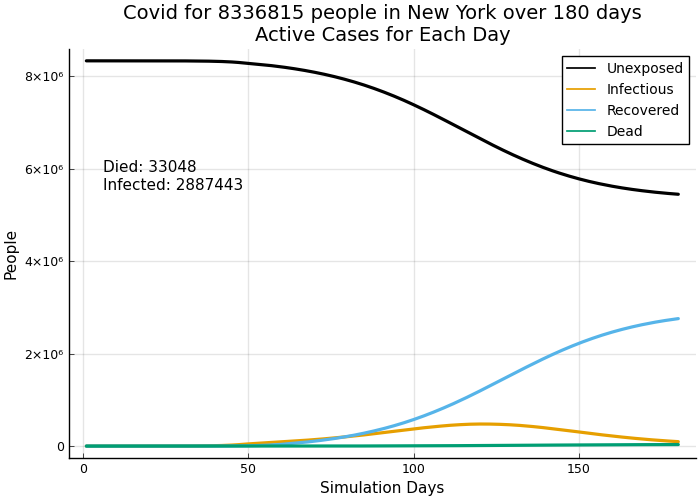 |

<b>Fig. 2: Strong social distancing begins day 50</b>

In figure 3, we show what happens when the social distancing and shelter-in-place guidelines are lessened. The outcomes are nearly as bad in infections and deaths as the unchecked case in which no social distancing ever happened. Epidemic scale infections are not over—they are just postponed. The number of cases and deaths grows to be very close to the scenario with no social distancing in figure 1. The virus spreads until there are no more susceptible, “Unexposed” people who can become infected. This hasn’t happened yet—it would be dreadful to allow it to happen.

| Bismarck: opening up                | New York: opening up                |
|:-----------------------------------:|:-----------------------------------:|
| 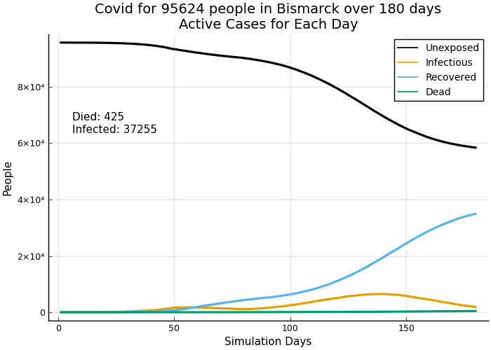 | 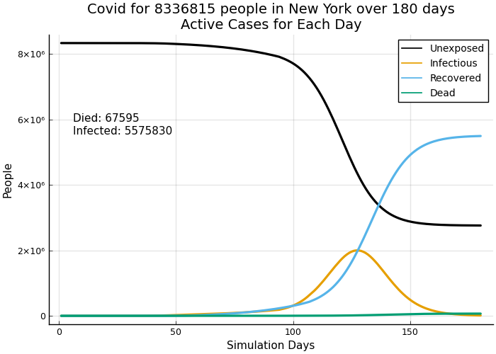 |

<b>Fig. 3: Opening up with some social distancing still in place</b>

In figure 4, we are showing the exact same simulations as figure 3, but we have removed the “Unexposed” and “Recovered” lines because those numbers are so big compard to “Infectious” and “Dead.” Now it is more obvious that this plays out differently in Bismarck than in New York. Bismarck is small enough that the active cases of infection had begun to decline during social distancing. Opening up restarts the path to exponential growth so the graph shows a "double bump." You don't see the bump in simulated New York because social distancing slowed the growth of active cases but the number of cases hadn’t starting going down yet. Instead of a "double bump", the New York graph shows a low ramp of infections and then the rate becomes very steep. Note that neither city is following the policies in these scenarios. New York is taking a more cautious approach to allowing more daily activity.

| Bismarck: "Double Bump"             | New York: "resumed take-off"        |
|:-----------------------------------:|:-----------------------------------:|
| 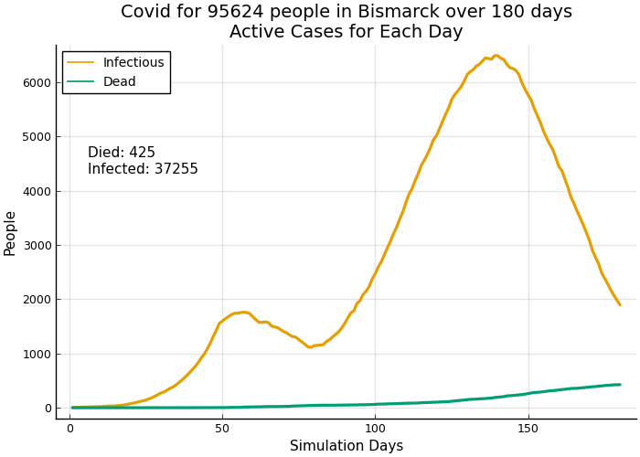 | 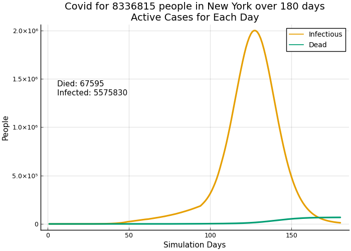 |

<b>Fig. 4: Focus on infections and deaths after opening up</b>

The pattern the simulation shows will happen in every locale with significant variations based on when the virus arrived in the locale, when social distancing started and when and by how much restrictions are eased. Other models based on similar approaches warn of renewed growth in the virus after “opening up.”[2] The consistent fact is that no locale has enough recovered people to provide the decline in cases referred to as herd immunity. This is not just math in the simulation. Within 2 to 5 weeks after “opening up” real cities are beginning to see the double bump or steeper growth in new infections and deaths.

On May 23, 2020, Governor Asa Hutchinson of Arkansas announced that his state was seeing a second peak in cases[3]: 

> The state saw a record high of 455 new cases Thursday, then 154 more new cases Friday. The past few days' numbers indicate a "second peak,"  Hutchinson said, with the previous peak occurring about 30 days ago.

It was bound to become much worse. Here is the plot of new daily cases for Arkansas through June 25, 2020 at a point approximately 6 weeks after opening up[4]. Arkansas is not especially bad, but the governor has reversed course from  dismissing the virus to factually acknowledging  what he is seeing. The highs and lows after May 23 (at the arrow) continue to  grow compared to the apparent decline in early May:

 

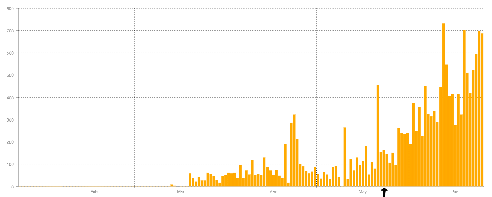

Around the US, the increase in deaths after "opening up" will probably be considered intolerable in every moderately sized urban area where population density is sufficient to fuel exponential growth. Sustaining strong social distancing for 2 to 3 more months may be the only way to keep cases low. Yet, the economic and social pressure to end social distancing is also real, so an approach that enables resumption of more activities *without* a dramatic increase in deaths must be found. 

### Test, Trace and Isolate

Test and trace focuses on testing healthy, active people to identify those who may be spreading the virus in the community, rather than primarily testing sick people to confirm the presence of the virus. People who test positive are interviewed to determine their recent contacts. Those who test positive are asked to enter a 14 day quarantine in their homes. Their contacts may be requested to come in for testing or, in some jurisdictions, the contacts are asked to immediately quarantine. The concept is simple: identify as many people as possible who test positive; focus on their contacts to find more people likely to test positive; quarantine those who tested positive; and allow other people to begin resuming some of their normal activities.

Figure 5 shows the favorable impact of test, trace and isolate (“test and trace” from now on) when implemented with very high rigor. In both cities, 10% of the population can be tested per day; 95% of those requested to enter quarantine comply; test results come back the same day and 20% of people in quarantine breakout of quarantine early. 

| Bismarck: Near maximum test and trace   | New York: Near maximum test and trace   |
|:---------------------------------------:|:---------------------------------------:|
| 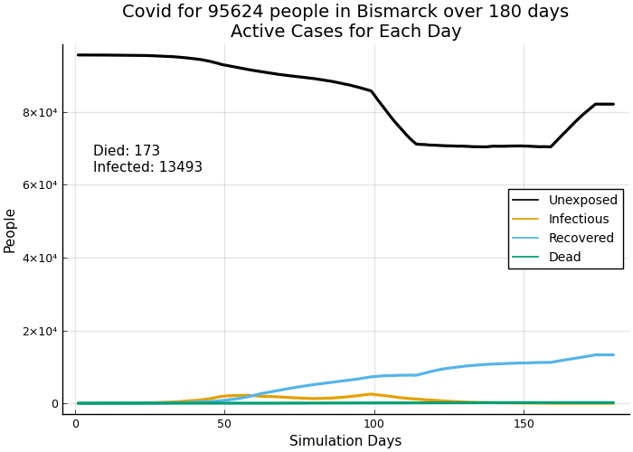 | 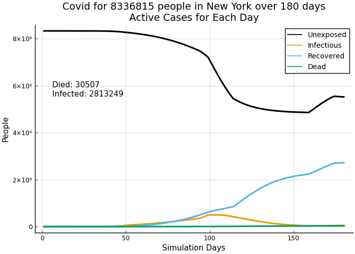 |

<b>Fig. 5: Daily test capacity = 10% of population; 95% quarantine compliance; same day test results; 20% breakout of quarantine early</b>

The odd shape of the "Unexposed" plot line is caused by test results with false positives. People who are unexposed exceed infected people by a large margin. A virus test with 90% *specificity* results in average false positive outcomes of 10%. A virus test with 90% *sensitivity* results in average true positive outcomes of 90% and average false negative outcomes of 10%. Because there are so many more unexposed people than infected people in these simulations,  *false* positives are almost as numerous as *true* positives. The unintended consequence is that *many uninfected people will be quarantined*. When they come out of quarantine, we see the bizarre result that unexposed people in circulation increase, when "Unexposed" should go down or level off. The more inaccurate the tests are, the more severe this can be. This seems like a mistake in testing, but in reality there is little visible difference between an uninfected person and an asymptomatic, infected person. On the other hand, false negatives result in some infected people not being asked to quarantine, who will continue spreading the virus.

In figures 6 and 7, we  show what happens as rigorous thresholds of implentation and compliance are not met. In figure 6, both cities are able to test 5% of their populations per day; 95% of those requested to enter quarantine comply; test results are returned the same day; and 20% of those quarantined "breakout" before 14 days are over. 

| Bismarck: mid-level test and trace      | New York: mid-level test and trace      |
|:---------------------------------------:|:---------------------------------------:|
| 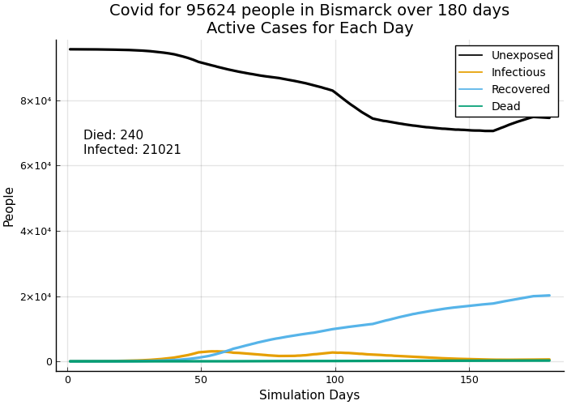 | 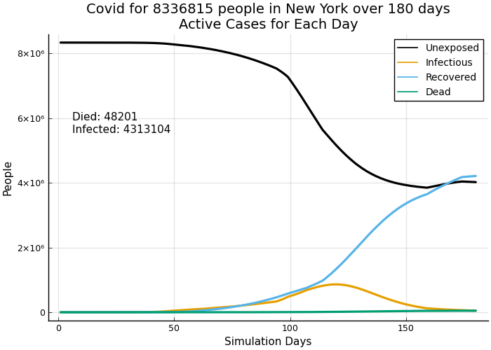 |

<b>Fig. 6: Daily test capacity = 5% of population; 95% quarantine compliance; same day test results; 20% breakout of quarantine early</b>

In figure 7, Bismarck and New York are only able to test 1% of their population per day; *test results take 3 days to come back*; only 75% of those tested positive comply with the quarantine request; and 20% of people who go into quarantine "breakout" before 14 days are over. The outcomes for infections and deaths are only slightly better than the "opening up" scenario in figures 3 and 4. 

| Bismarck: minimal test and trace        | New York: minimal test and trace        |
|:---------------------------------------:|:---------------------------------------:|
| 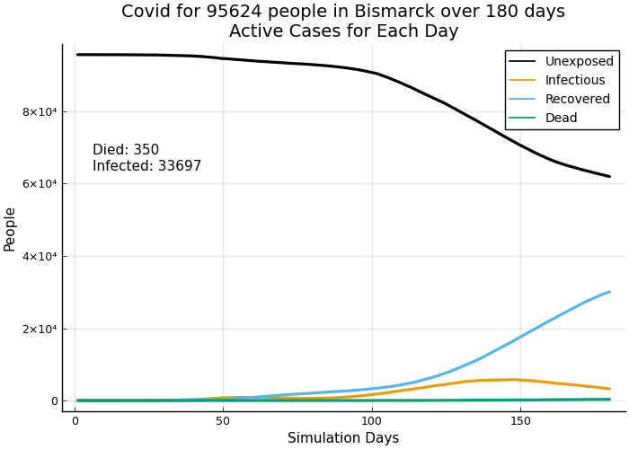 | 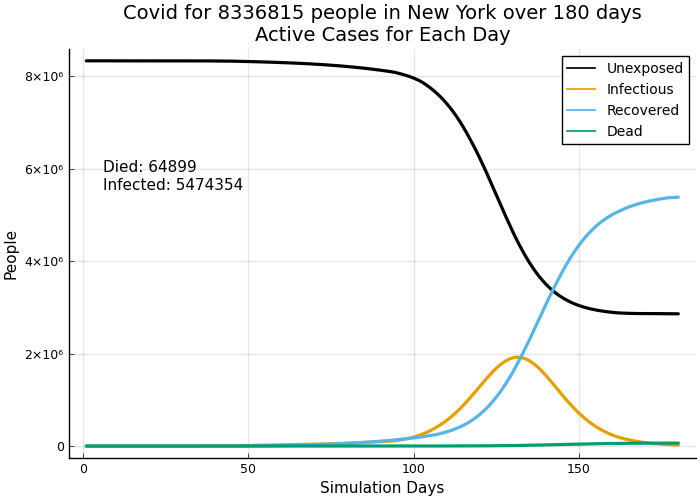 |

<b>Fig. 7: Daily test capacity = 1% of population; 75% quarantine compliance; test results in 3 days; 20% breakout of quarantine early</b>

These simulations show that high testing capacity, fast test results, and high compliance really keep infections and deaths low *after* opening up. Such high thresholds for implementing test and trace may be unachievable in most locales (see Discussion section, below). With lower achievement, the outcomes for infections and deaths will be only slightly lower than opening up, while causing high public health burdens and high social frustration. This will likely lead to a lack of cooperation with test and trace as people refuse to be tested or refuse to enter quarantines.

### Protect the Vulnerable

If test and trace were the only way we could try to keep the death rate from rising too high after opening up, we would have to try and hope for the best. But, there is a promising alternative. *We can shift the broad public health goal from preventing infection to preventing death.* This policy focuses on the segment of the population in which most deaths have occurred. First, we will outline steps of a practicable plan that focuses on preventing deaths among the most vulnerable people while allowing the many, less vulnerable people to return to some daily activities *while continuing moderate social distancing restrictions*. Then, we show the quantitative outcome for the protect the vulnerable policy.

A plan to protect the vulnerable must be more than “try to be cautious.” It has to be specific about what services are provided to vulnerable people and how to prevent them from encountering infected people. The plan has to be clear about who provides those services and how those people will be tested to ensure they don’t expose vulnerable people to the virus. Some elder care facilities already do some version of this plan; many, tragically, did not. We need to be able to scale this up to people in such facilities and to people who live at home by themselves or in multi-generational homes. We describe who should be considered vulnerable in the Discussion section, below. Here is the high-level outline of a plan for protect the vulnerable:

1. All testing capacity should be devoted to people who provide medical care, to people who provide services to the vulnerable, and to people who are being treated for Covid. This is quite different than test and trace, in which you *want* to test asymptomatic people who could be spreading the virus rather than testing those who are obviously (?) sick. Instead, we ask the vulnerable to voluntarily shelter-in-place and test anyone who interacts with the vulnerable. We don’t try to test someone who is very, very unlikely to die and we put everything into preventing infected people from contact with people who are the mostly like to die (but, still not *that* likely) and those who provide services to the vulnerable.
2. This is a range of services that should be provided to the vulnerable by workers who are frequently tested and repeatedly test negative:
   1. Medical care, especially including important non-Covid medical care that causes risk by being postponed.
   2. Personal care such as haircuts, manicures, and dental care that should be mobile and provided at home and in assisted living facilities and nursing homes.
   3. Reinforce the workforce and raise the minimum wages of all people who work in assisted living, extended care, and nursing homes. The low standards of service that were apparently provided in many facilties must be upgraded.
   4. Food delivery and food preparation for the vulnerable. Subsidized or completely free delivery should be available and easily obtained. 
   5. Delivery of prescriptions, retail medicine, and personal care products.
   6. Delivery of ordinary household and personal products. The activity coaches in the next point can act as concierges to help people unaccustomed to ecommerce in placing these orders.
3. As the duration of the epidemic continues, mental health becomes more important—especially for a group that may already feel isolated from family and friends. We recommend a social coaching corps to provide services such as:
   1. Be “Zoom” concierges to help the non-technical (or those without access to any suitable devices) be in touch with friends, loved ones, and family at least twice a month but ideally once a week.
   2. Be activity coaches who arrange and manage socially distant conversations (ok, maybe with yelling) and small group activities and help arrange the other services.
   3. Existing facilities in theory may have such people, but the elderly who live independently or in multi-generational homes will also need these services.
4. Public funding should be provided for many of the people who do these jobs. Depending on the employer, the funding could be partial or complete. Philanthropic funding should also be sought.
5. Care must be exercised to prevent profiteering and fraud in providing these services. Rather than an elaborate new bureaucracy, existing local social welfare agencies, ngo’s and family member volunteers whose loved ones require these services should be enlisted to be the watchdogs over delivery of these services. 
6. All of these services are more valuable and beneficial to people than an army of contact tracers manning the phone lines to an increasingly uncooperative populace. The people and resources that might be applied to contact tracing are better applied to directly serving the vulnerable.

We pointed out some challenges in implementing test and trace so it is only fair to point out implementation challenges for protect the vulnerable. Are all of those who serve or visit the vulnerable rigorously tested? What percentage of false negatives are there in the testing? Further modeling will be needed to evaluate these challenges. 

To compare opening up to protect the vulnerable, figure 8 repeats the plots of New York with strong social distancing in place on the left and opening up on the right. 

| New York: Strong social distancing  | New York: opening up               |
|:-----------------------------------:|:-----------------------------------:|
|  |  |

<b>Fig. 8: Compare New York with strong social distancing through the end of simulation with opening up</b>

Figure 9 shows the results of one possible implementation of protect the vulnerable. It combines two policy actions: i) lifting social distancing restrictions more than in the opening up scenarios above *with* ii) isolating 70% of people over 80 years old and 50% of people between 60 and 80. We chose comparatively low isolation percentages to allow for not modeling the various implementation challenges. Note that the infection number is high—approximately the same as opening up while the number of those who die is low—*approximately the same as maintaining social distancing for 4 months*.

| New York: Protect the vulnerable        |
|:-------------------------:|
| 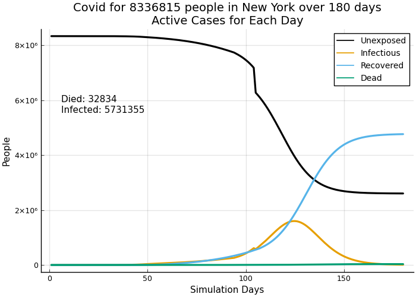 |

<b>Fig. 9: Opening up with Protect the vulnerable isolating 70% of people over 80, 50% of people between 60-80</b>

Figure 10 is a summary of the results for counts of infections and deaths for all of the simulations shown in the graphs:

|                          | Bismarck                            | New York              |
| ------------------------ |:-----------------------------------:|:---------------------:|
| Unchecked virus          | deaths: 661 infections: 59,044 | 76,214 6,500,886 |
| Strong social distancing | 118 9616                       | 33,048 2,887,443 |
| Opening up (partial)     | 425 37,255                     | 67,595 5,575,830 |
| Maximum test and trace   | 173 13,493                     | 30,507 2,813,249 |
| Mid-level test and trace | 240 21,021                     | 48,201 4,313,104 |
| Minimal test and trace   | 350 33,697                     | 64,899 5,474,354 |
| Protect the vulnerable   |                                     | 32,834 5,731,355 |

<b>Fig. 10: Comparison of infections and deaths across all simulations</b>

These results show that deaths for protect the vulnerable are less than half the scenario with no social distancing at all. Deaths are also much lower than relaxing social distancing by opening up. Further, deaths are roughly equal to sustaining stringent social distancing for 4 months (until the end of the 180 day simulation period), which is probably not politically possible. Deaths are much lower than test and trace with 1% testing capacity and significantly lower than test and trace with 5% testing capacity and high compliance. Only test and trace with 10% testing capacity and high compliance shows better results. It seems unlikely though that New York can conduct over 880,000 tests per day.

### Discussion

The concern with reliance on test and trace is not that it can’t work. It clearly can; it was the very first technique of mitigating consequences of epidemics and has grown more sophisticated with the application of medical and information technology. 

But, the middle of the Covid-19 epidemic in a very large country presents serious challenges to test and trace:

- Close to 80% of Covid infections are asymptotic or mild[5] so tests are required to determine disease status. Even in our late stage of the epidemic (or maybe it’s the middle), uninfected people are in the majority so there will be many false positives and many of the people asked to quarantine will be non-infectious.
- Transmission of the disease can occur for 5 to 12 days during the course of an infected person’s (mild) illness. When someone who tests positive is quarantined, that person might be at day 9 of the disease or day 2 (this is essentially impossible to know). In both cases, the requested quarantine will be 14 days. If a person “breaks out” of quarantine early—simply a matter of leaving the house—then either someone who is actually well does no harm or someone who is still infectious resumes spreading the disease.
- The preceding two factors require very high testing capacity. Even capacity to test around 5% of the population *daily* results in higher infections and deaths than the level of perpetutating stringent social distancing, which is clearly no longer possible. People will need to be tested multiple times, further challenging test capacity. If we test contacts of those who tested positive, then we need even more tests. In some jurisdictions, contacts of anyone who did test positive are *requested* to quarantine even though the contact is not tested. This policy (not used everywhere) can only reduce voluntary compliance with quarantine “requests.”
- Quarantine compliance is questionable in the US because quarantine means shelter with co-resident partners or family. The other members of the household have a high probability of becoming infected and spreading the disease. The US will not adopt South Korea’s approach of quarantining in publicly maintained facilities, with no visitors and no departure until testing negative. Nor will the US adopt China’s police enforcement of quarantines. 
- The three factors that worsen the effectiveness of test and trace are: insufficient test capacity, delays in test results, and non-compliance with contact calls or quarantining. 

We show that with high compliance and test capacity around 10% of the population per day, test and trace brings down deaths in line with stringent social distancing while allowing lessening of social distancing restrictions. But, very few jurisdictions in the US have anything like that capacity. Indeed, the federal government seems to want to keep it that way by recommending to US Congress that 300,000 tests per day—less than one tenth of 1 percent of the US population--would be sufficient. Rhode Island has by far the highest per capita testing in the US[6]. We don’t know how many days RI has been testing, but if all of their tests were conducted over the past 20 days, RI’s daily testing capacity would be only 7 tenths of one percent of the state's population. 

We cannot, however, eliminate test and trace from our epidemic fighting arsenal. At early stages of an epidemic, test and trace can substantially reduce an epidemic’s initial growth. And near the end of an epidemic, test and trace can help root out hold-out pockets of a disease, from which the disease may re-infect the broad population. Indeed, this is what lead to the eradication of smallpox and the hoped-for eradication of polio. It helped Taiwan almost eliminate the virus there.

A decline in social cooperation—which we are already seeing—is a more fundamental problem with widespread test and trace. In the case of a deadly disease like ebola less testing is necessary—one look at a sufferer tells you the person has it. Ebola is so deadly, in the range of 50-60%, that no one wants it so cooperation among the healthy is high. Covid-19, *fortunately*, is not like that. Gaining social cooperation is the challenge. A testing regime sufficient to manage the death rate from Covid-19, even with some loosening of social distancing restrictions, will be perceived as burdensome and will be challenging and costly to implement.

Protect the vulnerable requires much less testing than test and trace and focuses on testing people who are the most likely to be cooperative. Assuming an average caseload of 150 vulnerable people *per month* for each category of service provider described in the plan, we calculate that New York would need 3305 tests per day to provide 2 tests per week for each worker or just shy of 12,400 tests per day to provide *daily* tests to each worker. We have not accounted for providing backup workers for those who test positive and must withdraw from serving the vulnerable. Some tests would still be done in hospitals and clinics for those being treated and for frontline medical providers. *This is a much lower number of tests* than even the 1% threshold for test and trace, with dramatically lower deaths. More work is needed to examine other modeling outcomes and to estimate costs and compliance to compare test and trace with protect the vulnerable. This first approximation suggests that protect the vulnerable is more promising and more feasible than test and trace at this stage of the Covid-19 epidemic.

Who are the “vulnerable?” The elderly and just beyond middle-aged people are not the only vulnerable people, but they are the biggest part of the vulnerable. Nearly all deaths fall to people suffering underlying conditions including coronary-vascular diseases, diabetes, obesity, prior lung damage, immunosuppressant damage from medications or immune diseases, and hypertension. These conditions can exist in any age group but are more prevalent as we become older and are more likely to result in death with Covid as we grow older. Our modeling used people over 60 as the definition of the vulnerable group. This was not perfect, but in actual real world outcomes, over 80% of deaths fall to people over 65. Realize though that this is not a death sentence: among this age group the death rate of those infected is in the range of 5 to 15% and highly dependent on co-occurring conditions. The elderly dominate the dying because death rates in younger age groups are much, much lower. Figure 11 shows the age distribution of deaths in the US.

| Age Group         |Deaths | % of all Deaths|Over 65 and 60 |
| ----------------: | -----: | -----: |----------: |
| Under 1 year      | 5      | 0.01%  |    |
| 1-4 years         | 3      | 0.004% |    |
| 5-14 years        | 11     | 0.01%  |    |
| 15-24 years       | 93     | 0.11%  |    |
| 25-34 years       | 542    | 0.67%  |    |
| 35-44 years       | 1,403  | 1.72%  |    |
| 45-54 years       | 3,893  | 4.78%  |    |
| 55-64 years       | 9,776  | 12.01% |86.68% (split 55-64 in half)|
| 65-74 years       | 16,981 | 20.87% |80.67%|
| 75-84 years       | 21,822 | 26.82% |     |
| 85 years and over | 26,843 | 32.99% |     |
| All Ages          | 81,372 |        |     |

<b>Fig. 11: Age distribution of deaths in the US; CDC confirmed death certificates through 5/23/2020</b>

This vulnerable group can be identified and its members have dramatic incentive to self-identify. This is the key to reducing the linkage between Covid-19 infections in the overall population of younger (or less vulnerable) people and infections that lead to death among the vulnerable. By concentrating testing and the use of protective equipment almost exclusively on those who serve the vulnerable, such as medical personnel, food deliverers and preparers, personal care providers, social coaching helpers, and on first-line medical care providers to any and all age groups, we need many fewer tests and have the testing capacity to meet this need *with frequently repeated tests*. Protect the vulnerable relies on meeting the everyday needs of the vulnerable with a group of workers who are tested at least twice weekly and potentially daily.

“Protect the vulnerable” may sound too much like the approach Sweden adopted, which deliberately attempted to allow herd immunity to arrive while protecting elderly people. Though it was far from their intention, Sweden’s efforts to protect the elderly and other vulnerable groups have been unsuccessful, as Sweden's death rate continues to climb and is now the 7th worst in the world[7]. Protect the vulnerable as a plan makes no mention of herd immunity. Epidemiologists rightly consider overtly trying for herd immunity a very risky gamble because of the high cost in deaths. Another criticism is that “protect the vulnerable” is a figleaf for letting the virus run its course by ending social distancing and other safe practices. That is *not* the plan proposed here. We recognize that infection cases will go up, so serious adoption of this policy must isolate the groups that would otherwise experience high death rates and ensure that those who provide services to the vulnerable do not spread the virus to the them. That is the number one goal and requires focusing nearly all testing on those who serve the vulnerable population. 

The working age and school age population will still face some restrictions. This is not a plan for ending all restrictions as some criticism suggests. Large events that enable super-spreading must be restricted. *Inter-personal social distancing and use of simple protective equipment like masks must be used to reduce interpersonal transmission of the virus in workplaces and schools, to replace extensive lockdowns*. Many more people will be able to go back to work. Some people, who test negative repeatedly, may have new jobs providing services to the vulnerable, for which the government should provide wage support, equipment, and infrastructure. Working age people go back to work to a significant extent. Even with some increase in infections compared to isolation, most of these people face a small chance of severe disease and more medical care will be available when fewer elderly seek hospital care for Covid. Those not being tested must segregate from the vulnerable and the vulnerable must avoid contact with all but their designated caregivers (who might include family members and loved ones who test negative and test frequently).

The burden on public health workers and officials will be clearly focused on a direct mission with lower costs to perform and the likelihood of higher cooperation. Focus on a clearly identified group with an explicit list of services will make the job possible. Testing will be provided to people who need it and want to be tested. Providing service with less policing will make the public health job easier to perform.

#### The Social Contract of Protect the Vulnerable

The most important reason that protect the vulnerable works is because the social contract it assumes makes sense. In contrast, the social contract of test and trace doesn’t make sense: millions of people who will likely not be sick to any degree must accept meaningful impositions and limitations to protect a small minority who may die from infection. Morally, we *should* accept the impositions and limitations and most of us recognize this and do. But, the associated costs are rising and deaths *will* rise if we end social distancing without a plan. 

The social contract of protect the vulnerable is obvious and easier to bear. The vulnerable know who they are and will cooperate. Their incentive is life. Those who choose work to serve the vulnerable have made a choice. They must receive the testing, equipment and support needed to fulfill the responsibility they’ve chosen to accept. Everyone else will realize there is a vulnerable group and their own burden is to stay away and respect the precautions that workers serving the vulnerable must take. 

In return, we can lighten the restrictions most working age and school age people face. They will not face mandatory testing or quarantines. They know at least a few older or vulnerable people, but don’t choose the responsibility of caring for them—they have other responsibilities to people, like earning a living. Their burdens, still considerable as our economy struggles to regain its footing and provide more jobs, are different. It makes sense to focus on reducing deaths and not worrying as much about overall infection rates when we follow a clear and practical plan to reduce deaths among those who will otherwise suffer most of the severe illnesses and deaths.

This is a safer way to open the US. It is time to make this our plan.

##### Notes

[1] “How to Improve and Protect Nursing Homes From Outbreaks,” Paula Span, *The New York Times*, May 22, 2020

[2] “Projections Suggest Potential Late May COVID-19 Rebound,” Columbia University Mailman School of Public Health, May 7, 2020, https://www.publichealth.columbia.edu/public-health-now/news/projections-suggest-potential-late-may-covid-19-rebound

[3] "Arkansas Reports Rise of 163 Virus Cases," Rachel Herzog, *Arkansas Democrat Gazette*, May 24, 2020,  https://www.arkansasonline.com/news/2020/may/24/state-reports-rise-of-163-virus-cases-2/

[4] COVID-19 Dashboard by the Center for Systems Science and Engineering (CSSE) at Johns Hopkins University, https://coronavirus.jhu.edu/map.html

[5] “Coronavirus disease 2019 (COVID-19)Situation Report–46,” World Health Organization, https://www.who.int/docs/default-source/coronaviruse/situation-reports/20200306-sitrep-46-covid-19.pdf?sfvrsn=96b04adf_4

[6] "All State Comparison of Testing Efforts", Johns Hopkins University & Medicine Coronavirus Resource Center, https://coronavirus.jhu.edu/testing/states-comparison

[7] Sweden's death rate per 100,000 population stands at 45.56 as of June 6, 2020 compared to 33.36 in the United States. Deaths per 100,000 is the right basis for comparison because it eliminates the large inaccuracy in reported cases around the world. From "How does mortality differ across countries?," Johns Hopkins University & Medicine Coronavirus Resource Center, https://coronavirus.jhu.edu/data/mortality

### Appendix 1: CovidSim

CovidSim is a classic SEIR (Susceptible, Exposed, Infected, Removed) simulation of the COVID outbreak of 2019-2020 with some new twists, written in the Julia programming language. The model tracks groups of people in 8 categories by day in a given locale (city or region). Each locale has its own data structure for tracking people.  Multiple locales can be simulated in a single run. The groups are:

- Unexposed
- Infectious (summary of the 4 disease conditions)
- Recovered
- Dead
- Nil (infected and asymptomatic)
- Mild
- Sick
- Severe

The groups are further divided by age groups (0-20, 20-40, 40-60, 60-80, 80+) and "sickday," which refers to the number of days an infected person has had the disease. It is very easy to reduce or extend the maximum sickday and to run a simulation for any duration.

The basic processes of the simulation are:

- Spread
  The disease spreads from those who are infected to those who are not. Transmissibility varies with the number of days that someone spreading has had it, with asymptomatic transmission assumed. Susceptibility varies by age group of the recipient.
- Transition
  A person who is sick with the virus transitions through the stages from nil to either recovered or dead, based on user-defined decision trees that vary by age group.

Basic tracking includes cumulative data series for each group, new daily values for each group, and detailed daily progression of spreading.  Charts are defined for cumulative data, daily data, and spreading progression.

There are many input parameters that control the behavior of the simulation. Key parameters that affect spreading are:

- contact_factors 
  Determine the number of people that infectious "spreaders" contact, on average, per day. These vary by age group and disease condition of the spreader.
- touch_factors 
  Determine the probability that a contact is consequential--significant enough to potentially transmit the virus 
- send_risk and recv_risk 
  Determine the probability of actually transmitting the virus from sender, which varies by number of days the person has had the disease, and the probability of infecting the recipient, which varies by age group.
- r0 simulation
  The model is more complicated than assuming one r0 applies to the entire population. R0 is *not* an input; it is an outcome. The factors above provide different effective transmission rates for different age groups, disease conditions, and stage of infection. The r0 simulation provides a sanity check on transmission to see the resulting r0 for a single cohort that includes all age groups and sickdays. The model defaults provide for an early stage R0 of roughly 1.8. (Early stage assumes that the infected group is small relative to the population so that transmission is not affected by a large group of non-susceptible people, who may be dead, recovered, or already infected).  The r0 simulation can be run "mid-stream" during a simulation to see how case scenarios and epidemic dynamics change shortrun r0, which is as much socially determined as biologically.

Transition of infected individuals (in the disease cell groups above) is controlled by input decision trees:

- decision trees 
  1 per age group, determine when the condition of an infected person shifts from nil, to mild, to sick, to severe, to recovering or dying. The tree provides different paths through the stages in varying number of days and probabilities, including skipping disease states.
- sanity check on decision trees
  Each decision tree (for an age group) must insure that all infected individuals resolve to recovered or dead at the end of the maximum sickday period (25 days by default). Total probability across all outcomes must sum to 1.0.  The sanity check can be quickly run on a set of decision trees for all 5 age groups. In addition to verifying that probabilities sum to 1, this provides the expected (mean) % of recovered and dead by age group, which can be compared to reported clinical outcomes. Read more...

A benefit of the model is comparative ease for running a variety of test cases to examine the response of disease progression to events and potential policy interventions:

- seeding
  Travel modeling is planned. In the meantime, seeding events can be defined to introduce infectious people to a locale.  This can occur on any day and introduce people of any condition or sickday.  This enables "manually" causing travel of the disease to new locales when multiple locales are simulated. Multiple seeding events can easily be included in a single simulation run.
- isolation
  With a simple callback function approach, people can be isolated on a given day in a given locale and can be "un-isolated" later.
- social distancing
  The factors that drive spread of the virus can be changed with a complying and non-complying group. A subsequent "event" can change the degree of social distancing and the compliance to simulate varying degrees of "opening up."
- test, trace and isolate
  A group-based SEIR model cannot trace individual testing and outcomes but we can distribute tests for breadth, determine outcomes for the tested group, determine contacts, isolate those with positive test results and repeat through multiple generations of contacts. Many factors can be set such as test capacity per day, test compliance, contact compliance, early "breakout" from isolation, and sickday time to receive test results.

Epidemiological Models

There are several different approaches to epidemiological models that have been developed for a long time and various experiences applying models to the current COVID-19 epidemic have been reported. This paper summarizes the various model approaches applied to COVID-19 non-judgmentally[1]. Time series forecasting of the most rigorous kind applied correctly to reported infection and death data through as late as May 1, 2020 seems challenged by incompleteness of data as both infections and deaths may be seriously under-reported[2]. SEIR simulations have different challenges because their input parameters, which  represent social behaviors and clinical factors,  are difficult to define given unknowns about the disease. Attempting to correlate the two kinds of models is difficult: time series forecasts are subject to data quality challenges; SEIR models differ substantially from reported data. At this juncture, it may be more important to understand the dynamics of the epidemic that SEIR models provide, while critically examining such models for plausibility.

[1] "Prediction and analysis of Coronavirus Disease 2019," Lin Jia, Kewen Li， Yu Jiang, Xin Guo, and Ting zhao, https://arxiv.org/abs/2003.05447

[2] "Correcting under-reported COVID-19 case numbers: estimating the true scale of the pandemic," Kathleen M. Jagodnik, Forest Ray, Federico M. Giorgi, and Alexander Lachmann, medRxiv pre-print, https://www.medrxiv.org/content/10.1101/2020.03.14.20036178v2
