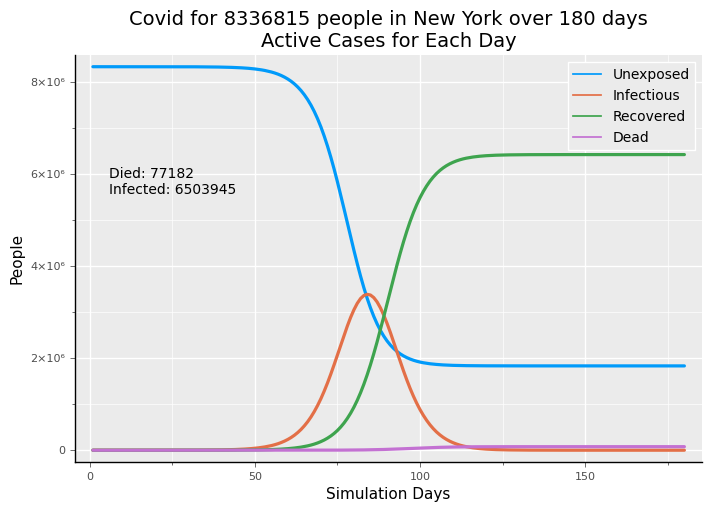
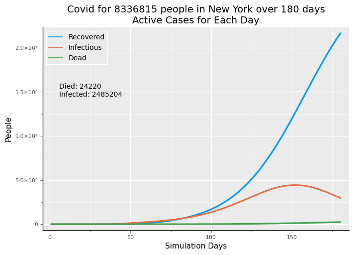
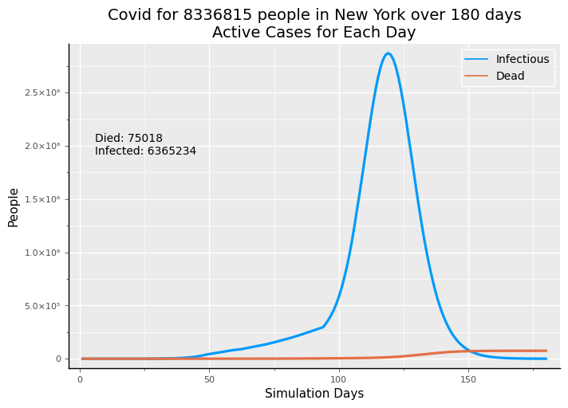
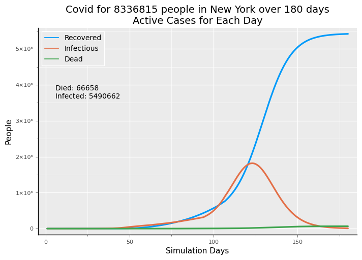
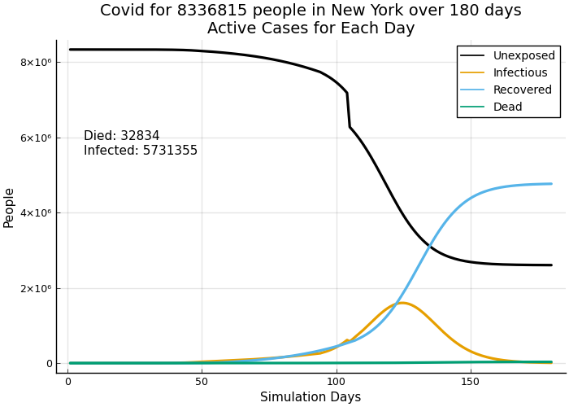

```julia
using CovidSim
```

    ┌ Warning: /Users/lewis/.julia/packages/Plots/ninUP/src/Plots.jl/ is not an existing directory, Revise is not watching
    └ @ Revise /Users/lewis/.julia/packages/Revise/jVsKo/src/Revise.jl:492


```julia
seattle = (;fips=53033); newyork=(;fips=36061); bismarck=(;fips=38015)
```


    (fips = 38015,)


```julia
geo = CovidSim.readgeodata("../data/geo2data.csv")
geo[:,1:7]
```


    15×7 Array{Any,2}:
      6075  "San Francisco"  "San Francisco"  "CA"  2   881549  17255
     53033  "Seattle"        "Seattle"        "WA"  2  2252782   5175
     36061  "New York"       "New York"       "NY"  1  8336817  40306
     39035  "Cuyahoga"       "Cleveland"      "OH"  2  1235072   3063
     48113  "Dallas"         "Dallas"         "TX"  2  2635516   4000
     39151  "Stark"          "Canton"         "OH"  3   370606   1688
     34013  "Essex"          "Newark"         "NJ"  3   798975   6396
     13089  "DeKalb"         "Atlanta"        "GA"  2  1063937   2708
     17167  "Sangamon"       "Springfield"    "IL"  3   194672   1747
     38015  "Burleigh"       "Bismarck"       "ND"  3    95626   2157
      4013  "Maricopa"       "Phoenix"        "AZ"  1  4485414   2798
     42003  "Allegheny"      "Pittsburgh"     "PA"  2  1216045   5461
     27053  "Hennepin"       "Minneapolis"    "MN"  2  1265843   7821
     31055  "Douglas"        "Omaha"          "NE"  2   571327   3378
      8031  "Denver"         "Denver"         "CO"  2   727211   4520


```julia
seed_1_6 = seed_case_gen(1, [0,3,3,0,0], 1, nil, agegrps)
```


    (::CovidSim.var"#scase#110"{CovidSim.var"#scase#109#111"{Int64,Array{Int64,1},Int64,Int64,UnitRange{Int64}}}) (generic function with 1 method)


```julia
alldict, series = run_a_sim(180,newyork.fips, showr0=false, silent=true,
       dtfilename="../parameters/dec_tree_all_25.csv",
       runcases=[seed_1_6]);
```

    *** seed day 1 locale 36061....
    Simulation completed for 180 days.


```julia
cumplot(series,newyork.fips,geo=geo)
```





```julia
infection_outcome(series, newyork.fips)
```


    (infect_pop = 0.7801487355653703, death_pct = 0.011866940571969254, death_pop = 0.009257978682251207)


### Strong Social Distancing

Reset the model to defaults.


```julia
alldict, series = run_a_sim(180,newyork.fips, showr0=false, silent=true,
       dtfilename="../parameters/dec_tree_all_25.csv",
       runcases=[seed_1_6]);
```

    *** seed day 1 locale 36061....
    Simulation completed for 180 days.


```julia
str_50 = sd_gen(start=50, comply=.9, cf=(.5,1.2), tf=(.18,.42))
```


    (::CovidSim.var"#sd_mod#123"{CovidSim.var"#sd_mod#122#124"{Int64,Float64,Tuple{Float64,Float64},Tuple{Float64,Float64}}}) (generic function with 1 method)


```julia
alldict, series = run_a_sim(180,newyork.fips, showr0=false, silent=true,
       dtfilename="../parameters/dec_tree_all_25.csv",
       spreadcases=[str_50],
       runcases=[seed_1_6]);
```

    *** seed day 1 locale 36061....
    Simulation completed for 180 days.


```julia
cumplot(series,newyork.fips,[recovered, infectious, dead],geo=geo)
```





```julia
infection_outcome(series, newyork.fips)
```


    (infect_pop = 0.33367934901711194, death_pct = 0.00870652712737448, death_pop = 0.0029051883040621417)


### Open Totally (which won't happen...)
This uses opening back to essentially no social distancing and an R0 between 1.6 and 1.8. People will voluntarily be more prudent and government recommendations and policies will provide for more limited opening. So, this shows why complete opening isn't possible:  the full force of the virus does return with only a slight delay.


```julia
# Reset to defaults
alldict, series = run_a_sim(180,newyork.fips, showr0=false, silent=true,
       dtfilename="../parameters/dec_tree_all_25.csv",
       runcases=[seed_1_6]);
```

    *** seed day 1 locale 36061....
    Simulation completed for 180 days.


```julia
open = sd_gen(start=95, comply=0.0, cf=(.3,1.8), tf=(.18,.62))
```


    (::CovidSim.var"#sd_mod#123"{CovidSim.var"#sd_mod#122#124"{Int64,Float64,Tuple{Float64,Float64},Tuple{Float64,Float64}}}) (generic function with 1 method)


```julia
alldict, series = run_a_sim(180,newyork.fips, showr0=false, silent=true,
       dtfilename="../parameters/dec_tree_all_25.csv",
       spreadcases=[str_50, open],
       runcases=[seed_1_6]);
```

    *** seed day 1 locale 36061....
    Simulation completed for 180 days.


```julia
cumplot(series,newyork.fips,[infectious, dead],geo=geo)
```





```julia
r0_sim(;sa_pct=[1.0,0.0,0.0], density_factor=1.25, dt=alldict["dt"], cf=[], tf=[],
                compliance=[1.0], shift_contact=(.6,1.8), shift_touch=(.18,.62), disp=false, spreadparams=spreadparams)
```


    (r0 = 1.822596153846154, spreaders = 2080, contacts = 129, touched = 65, infected = 3791)


The preceding estimate of R0 tracks one cohort across all demographic groups of the simulation through the duration of the disease for 25 days, though much of the cohort will "drop out" through recovery or death prior to the 25th day. Infectiveness varies across the number of days a person has been infected.  

### Limited Opening


```julia
# reset the model to defaults
alldict, series = run_a_sim(180,newyork.fips, showr0=false, silent=true,
       dtfilename="../parameters/dec_tree_all_25.csv",
       runcases=[seed_1_6]);
```

    *** seed day 1 locale 36061....
    Simulation completed for 180 days.


```julia
open = sd_gen(start=95, comply=0.7, cf=(.5,1.5), tf=(.25,.50))
```


    (::CovidSim.var"#sd_mod#123"{CovidSim.var"#sd_mod#122#124"{Int64,Float64,Tuple{Float64,Float64},Tuple{Float64,Float64}}}) (generic function with 1 method)


```julia
alldict, series = run_a_sim(180, newyork.fips, showr0=true, silent=true,
       dtfilename="../parameters/dec_tree_all_25.csv",
       spreadcases=[str_50, open],
       runcases=[seed_1_6]);
```

    *** seed day 1 locale 36061....
    at day 10 r0 = 1.39
    at day 20 r0 = 1.4
    at day 30 r0 = 1.39
    at day 40 r0 = 1.43
    at day 50 r0 = 0.77
    at day 60 r0 = 0.76
    at day 70 r0 = 0.74
    at day 80 r0 = 0.71
    at day 90 r0 = 0.71
    at day 100 r0 = 0.96
    at day 110 r0 = 0.79
    at day 120 r0 = 0.58
    at day 130 r0 = 0.43
    at day 140 r0 = 0.35
    at day 150 r0 = 0.32
    at day 160 r0 = 0.32
    at day 170 r0 = 0.32
    at day 180 r0 = 0.31
    Simulation completed for 180 days.


```julia
cumplot(series,newyork.fips,[recovered,infectious, dead],geo=geo)
```





Even with some restrictions still in place, this opening results in only about 10 to 11% reduction in deaths compared to never having implemented social distancing or social distancing followed by completely opening. This alternative would *not* be recommended. Rigorous implementation of test, trace and isolate with idespread testing of asymptomatic people, same-day test results, and high compliance with contact tracing and quarantine isolation is very hard to achieve, but is a preferred alternative.  If the high degree of compliance and implementation rigor is not possible, is there an alternative?


### An Alternative: Fewer Restrictions with Protection of the Vulnerable
Note that this cases models vulnerable people as the age groups from 60 to 80 and over 80. Other people are vulnerable: people with diabetes, hypertension, immuno-compromise, cancer patients, smokers, and others across age groups. It's beyond this model to attempt to represent these vulnerabilities across age groups at this poing.


```julia
open_more = sd_gen(start=95, cf=(.5,1.55), tf=(.25,.55),comply=.6)
```


    (::CovidSim.var"#sd_mod#123"{CovidSim.var"#sd_mod#122#124"{Int64,Float64,Tuple{Float64,Float64},Tuple{Float64,Float64}}}) (generic function with 1 method)


```julia
r0_sim(;sa_pct=[1.0,0.0,0.0], density_factor=1.25, dt=alldict["dt"], cf=[], tf=[],
                compliance=[.65], shift_contact=(.5,1.55), shift_touch=(.25,.52), disp=false, spreadparams=spreadparams)
```


    (r0 = 1.3158653846153847, spreaders = 2080, contacts = 117, touched = 57, infected = 2737)


```julia
function isolate_vulnerable(locale; opendat=openmx, isodat=isolatedmx,testdat=openmx, spreadparams=spreadparams)
    if day_ctr[:day] == 105
        isolate!(.70,[unexposed, nil,mild,sick, severe],[5],1:sickdaylim, locale; opendat=opendat, isodat=isodat)
        isolate!(.50,[unexposed,nil,mild,sick, severe],[4],1:sickdaylim, locale; opendat=opendat, isodat=isodat)
    end
end
```


    isolate_vulnerable (generic function with 1 method)


```julia
# reset the model to defaults
alldict, series = run_a_sim(180,newyork.fips, showr0=false, silent=true,
       dtfilename="../parameters/dec_tree_all_25.csv",
       runcases=[]);
```

    Simulation completed for 180 days.


```julia
alldict, series = run_a_sim(180, newyork.fips, showr0=true, silent=true,
       dtfilename="../parameters/dec_tree_all_25.csv",
       spreadcases=[str_50, open],
       runcases=[seed_1_6, isolate_vulnerable]);
```

    *** seed day 1 locale 36061....
    at day 10 r0 = 1.38
    at day 20 r0 = 1.4
    at day 30 r0 = 1.39
    at day 40 r0 = 1.4
    at day 50 r0 = 0.75
    at day 60 r0 = 0.79
    at day 70 r0 = 0.79
    at day 80 r0 = 0.78
    at day 90 r0 = 0.72
    at day 100 r0 = 1.0
    at day 110 r0 = 0.86
    at day 120 r0 = 0.63
    at day 130 r0 = 0.45
    at day 140 r0 = 0.36
    at day 150 r0 = 0.31
    at day 160 r0 = 0.32
    at day 170 r0 = 0.32
    at day 180 r0 = 0.32
    Simulation completed for 180 days.


```julia
cumplot(series,newyork.fips,[recovered,infectious, dead],geo=geo)
```





**Assessment:**
With opening somewhat more liberal and with lower compliance, we observe simulated deaths that are less than half of both the case of no social distancing ever and social distancing followed by opening with light restrictions held in place. The number of deaths is roughly 30 to 35% higher than maintaining restrictive social distancing for four months, until the end of the simulation duration of 180 days. But, that is not occurring anywhere in the US and is not politically possible nor practicable as compliance would continue to wain despite the terrible outcomes of opening up. 

Comparing the protect the vulnerable approach to versions of opening up, with and without test, trace and isolate
- deaths roughly 50% lightly restricted opening up;
- somewhat lighter restrictions than the preceding;
- deaths roughly 10% higher than very rigorous test, trace and isolate
- deaths roughly 50% lower than loosely implemented test, trace and isolate


```julia
protected_group = age_dist .* series[newyork.fips][:cum][1,map2series.unexposed[6]]
protected_group = protected_group[4] + protected_group[5]
```


    1.859108407e6


```julia
caseload_protected = 150 # per month
workers_protected = protected_group / caseload_protected
tests_required_month = 8 * workers_protected
tests_required_day = tests_required_month / 30
```


    3305.0816124444445


```julia
tests_required_month = 30 * workers_protected
tests_required_day = tests_required_month / 30
```


    12394.056046666667


```julia

```
